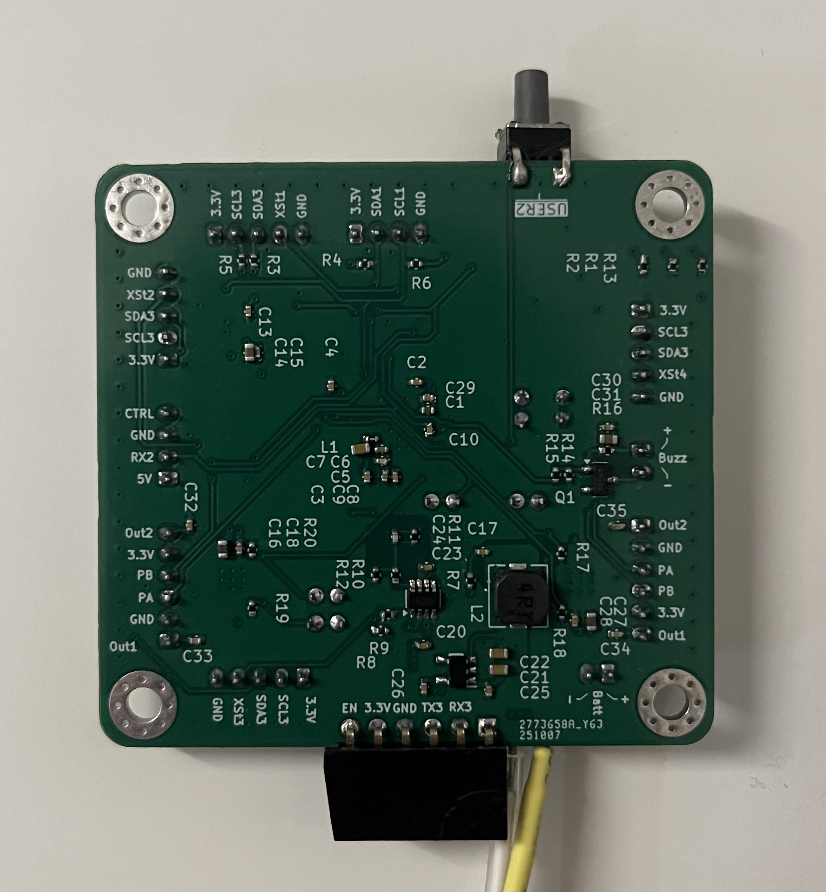
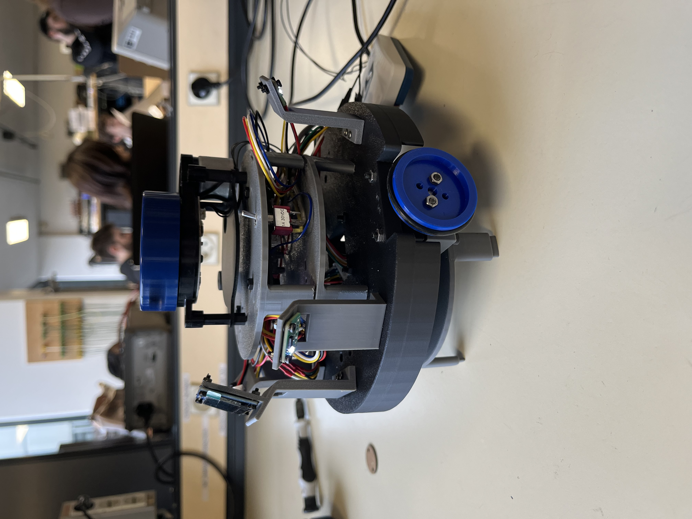

# Contexte général du projet  

Comme expliqué précédemment, le but de notre projet est de concevoir un robot capable de jouer au jeu du chat et de la souris de manière complètement autonome sur une table.   
Pour plus d'informations sur le projet : [cliquez ici](Descriptif%20du%20projet.pdf)  

Pour se faire, seuls les composants utilisés dans le projet nous sont imposés : [liste des composants](Liste%20des%20composants%20disponibles.pdf)  
Charge à nous :  
- de développer une PCB
- de programmer les différents modules : capteurs, actionneurs, écran OLED et module de communication bluetooth
- d'intégrer tous les modules ensemble, de tester et vérifier le bon fonctionnement de l'ensemble  

# Aspects techniques liés au projet

## Schéma d'architecture fonctionnelle  

Après une première réunion portant sur l'architecture fonctionnelle de notre robot, voici le schéma fonctionnel que nous adoptons pour notre robot :  
  

## Diagramme des tâches  

Voici un diagramme des tâches qui résume le fonctionnement de notre robot :


Les priorités étant définies dans le fichier de configuration `freeRTOS_tasks_prority.h` :

```c
#define ADXL_TaskRead_PRIORITY 2
#define ADXL_TaskPrint_PRIORITY 1

#define task_ROOMBA_PRIORITY 6
#define task_CHAT_PRIORITY 2
#define task_SOURIS_PRIORITY 2
#define task_EDGE_PRIORITY 6

#define task_Control_PRIORITY 5

#define task_ENC_D_Update_PRIORITY 6
#define task_ENC_G_Update_PRIORITY 6
#define task_Odom_Update_PRIORITY 3

#define task_BLUETOOTH_TX 1
#define task_BLUETOOTH_RX 2

#define task_LIDAR_Update_PRIORITY 3

#define task_motor_PRIORITY 5

#define task_screen_PRIORITY 1
```

## Organisation du projet sur STM32CubeIDE  

D'un point de vue global, nous avons choisi d'organiser notre projet de la manière suivante :  

| Fichiers sources | Fichiers headers |
|--------|---------|
|  |  |  

### 📝 Description détaillée fichiers sources

#### 📦 Dossier `actuators/` – Gestion des actionneurs

| Fichier | Rôle |
|--------|------|
| **behavior.c** | Implémente les comportements de haut niveau (navigation et stratégie de déplacement). |
| **control.c** | Contient les fonctions de contrôle moteur, coordination PID, gestion des vitesses/couple. |
| **encoder.c** | Gestion des encodeurs : lecture des ticks, calcul de vitesse et position. |
| **motor.c** | Interface bas niveau pour piloter les moteurs (PWM, direction, enable/disable). |
| **pid.c** | Implémentation des régulateurs PID utilisés par `control.c` et `behavior.c`. |

#### 📦 Dossier `bluetooth/` – Communication Bluetooth

| Fichier | Rôle |
|--------|------|
| **bluetooth.c** | Gestion du module Bluetooth : initialisation, envoi/réception de données. |

#### 📦 Dossier `oled_screen/` – Afficheur OLED

| Fichier | Rôle |
|--------|------|
| **oled.c** | Gestion d’un écran OLED : affichage de texte, images, et initialisation. |

> Remarque : Drivers OLED importé depuis internet et modifié se situant dans le dosser `Drivers/OLED/`.

#### 📦 Dossier `sensors/` – Capteurs du robot

| Fichier | Rôle |
|--------|------|
| **accelerometers.c** | Lecture de l’accéléromètre (IMU), calibration, filtrage. |
| **lidar.c** | Interface avec un LiDAR : récupération des distances, gestion du capteur. |
| **tofs.c** | Gestion des capteurs Time-of-Flight. |

#### 🧵 FreeRTOS

| Fichier | Rôle |
|--------|------|
| **app_freertos.c** | Définition des tâches FreeRTOS, files de messages, mutex et scheduling. |

#### ⚙️ Core système

| Fichier | Rôle |
|--------|------|
| **main.c** | Point d’entrée du programme, initialisations des différents capteurs, créations des différentes tâches et démarrage du RTOS. |
| **syscalls.c** | Implémente les fonctions système nécessaires (malloc, printf…). |
| **sysem.c** | Gestion du système et interrupt handlers (auto-généré). |
| **system_stm32g4xx.c** | Configuration de l’horloge système et initialisation MCU. |

#### 🔧 Drivers Hardware Abstraction Layer (HAL)

| Fichier | Rôle |
|--------|------|
| **dma.c** | Initialisation du DMA pour les transferts mémoire ↔ périphériques. |
| **gpio.c** | Configuration des broches GPIO (mode, pull-up/down, vitesse…). |
| **i2c.c** | Initialisation du bus I2C utilisé par IMU, OLED, ToF. |
| **tim.c** | Configuration des timers : PWM moteurs, interruptions, timebase. |
| **usart.c** | Gestion de la communication série UART (console, Bluetooth). |
| **stm32g4xx_hal_msp.c** | Fonctions MSP auto-générées : clocks, GPIO, interruptions. |
| **stm32g4xx_it.c** | Gestion des interruptions globales du microcontrôleur. |
| **stm32g4xx_hal_timebase_tim.c** | Gestion de la base de temps HAL via TIM. |  

### 📝 Description détaillée fichiers headers

#### 📦 Dossier `oled_screen/` – Gestion de l’OLED

| Fichier | Rôle |
|--------|------|
| **bitmaps.h** | Ressources graphiques (icônes, images) utilisées par l’écran OLED. |  

#### 🧵 FreeRTOS

| Fichier | Rôle |
|--------|------|
| **FreeRTOSConfig.h** | Configuration du kernel FreeRTOS (priorités, timers, heap…). |
| **freeRTOS_tasks_priority.h** | Définition des priorités de tâche et organisation du multitâche. |

#### ⚙️ Core du programme

| Fichier | Rôle |
|--------|------|
| **main.h** | Déclarations globales, includes principaux et prototypes de `main.c`. |

# Point HARDWARE  

> Remarque : Pour évaluer la partie hardware, merci de vous référer au KiCAD V2, étant donné que les problèmes identifiés ont été corrigés et le schéma refait au propre. La V1 n’a pas été modifiée afin de rester la plus fidèle possible à la version physique reçue et utilisée.

### Composants

Nous avions pour les missions principales, une liste de composants que nous devions utiliser ce qui a conditionné nos choix mais les a aussi simplifiés.
Voici les composants ajoutés :
- Écran OLED → ssd1306 
  - écran personnel de Nelven pour pouvoir le comprendre et le réutiliser pour de prochains projets.
- Bipper
  - Ajout d'un bipper pour avoir un différent moyen des autres groupes de notifier des choses (mode chat par exemple).
- Connecteurs JST-PH
  - Un pas de 2.0mm permettant de mettre tous les connecteurs sur une face du PCB ce que ne permettait pas les JST-XH (2.54mm) et en étant plus simple à souder/connecter que des JST-SH(1.0mm).

### Schéma électrique

Dans cette partie il n'y a pas grand chose à ajouter, étant donné que les circuits on été réalisé à l'aide des datasheet, de mes propres connaissances sur d'anciens projets.

### Routage

#### Positionnement face F/B

Un choix a été effectué afin de simplifier la soudure :

- Tous les composants passifs, régulateurs et transistors sont placés sur une même face du PCB.
- Tous les connecteurs, SoC, quartz, condensateurs électrolytiques, LED et boutons sont placés sur l’autre face.

De cette manière, sur la face inférieure, il est possible d’observer les circuits et de souder l’ensemble des petits composants au four en une seule opération.
Sur la face supérieure (visible) se trouvent les SoC, les connecteurs et les LED, c’est-à-dire les unités et modules nécessaires au fonctionnement du système, ainsi que les composants les plus volumineux à souder.

#### Positionnement sur la carte

J'ai choisi de ne pas mélanger les parties puissance et signal à différents endroits de la carte. En considérant que le bas du PCB se trouve au niveau du branchement de la batterie, j'ai positionné les composants de la manière suivante :

- **Bas du PCB → partie puissance**
  - Arrivée de la batterie [bas gauche]  
  - Interrupteur d’alimentation ON/OFF [bas gauche]  
  - Convertisseurs $V_{BATT}/5V$ et $5V/3.3V$ [bas milieu]  
  - Condensateur électrolytique [bas milieu]  
  - Drivers moteurs (alimentés en $V_{BATT}$)  
    - Carte retournée sur le robot : driver droit à [bas gauche] et driver gauche à [bas droit], pour simplifier les branchements  

- **Milieu/Haut du PCB → partie signal**
  - MCU [milieu]  
  - Connecteur ST-Link [haut droit]  
  - ADXL [haut droit]  
  - Quartz [milieu] avec ses deux condensateurs de l’ordre de la dizaine de nanofarads  
  - Boutons [haut gauche]  
  - 3 LED [haut gauche]  
    - **ROUGE** : $3.3V$, allumée en permanence lorsque la carte est sous tension  
    - **BLEU** : LED1 pour programmation/debug  
    - **VERT** : LED2 pour programmation/debug

À noter que j'ai respecté les consignes de routage pour le `convertisseur buck` fournies dans la datasheet, ce qui occupe une certaine place sur la carte.

Et tout autour de la carte les différents connecteurs pour tout relié à la carte.

`Face avant` :


`Face arrière` :




# Point SOFTWARE & FIRMWARE

Décrire ici les choix faits lors de l'implémentation du code C : pourquoi avoir organisé notre code comme ça par rapport aux fichiers et à la structure globales, pourquoi avoir choisi de faire des drivers et structure et du FreeRTOS, décrire + explique pourquoi les comportements que nous avons choisi pour le robot : ROOMBA, CHAT, SOURIS, EDGE.  

# Problèmes rencontrés lors du projet    

### Hardware

Du côté Hardware, les problèmes rencontrés ont été solutionnés dans la V2 que l'on trouve dans `Hardware/KiCad V2/` avec readme associé qui explique les changement :

> Remarque : la carte physique utilisée reste la V1 ; cette V2 constituerait donc sa remplaçante dans le cas où l’on souhaiterait améliorer le projet.

#### Modifications sur la V1

- Problèmes sur la taille des empreintes pour les capacités >= 10uF -> Passage en 0603
- Changement pad sw wurth vers un connecteur (plus propre) -> JST_PH Batterie +/- (Pin_x2) en JS_PH_ Batterie +/- et +/IN du switch wurth (Pin_x4)
- Erreur sur un des deux drivers où les silkscreen des OUT1 et OUT2 sont inversé par rapport au pin (Quand on se place dans le sens avec TX4/RX4 du ST-Link -> Driver gauche)
- Ajout Silkscreen sur ST-Link pour simplifier la connexion
- Modification schématique/Nom du bon NMOSFET -> SQ2310ES
- Changement de la capacité de découplage du VDDA : 47uF -> 22uF
- Oublie des capacités pour limiter les rebonds sur USER1 et USER2 -> ajout de 0.1uF
- Inversion sur le PCB des RX3/TX3 sur les pins PB10/PB11 du STM32
- Problème d'angle droit sur la ligne SDA3 enlevé (peut-être incidence sur l'I2C3)
---
Modification non faite mais à connaître pour de futurs projets 
- Utilisation du PB4 (BOOT0) pour le xshunt du ToF1 → pose problème car relié en interne à un GPIO relié ici au FWD ou REV d'un driver moteur → réinitialise la carte.
    - Solution : ne jamais utiliser la broche `BOOT0` pour autre chose même si l'on est censé pouvoir le faire

#### PIN BOOT0

Même si cela constitue une répétition par rapport aux lignes précédentes, nous tenons à insister sur le fait que, sur les STM32, bien qu’il soit parfois possible d’utiliser la broche `BOOT0` selon le microcontrôleur, il est fortement déconseillé de le faire. En effet, cela peut entraîner des problèmes de fonctionnement, comme observé avec les capteurs ToF ci-dessus, mais également compliquer la programmation.

Dans notre cas, nous avons dû utiliser `STM32CubeProgrammer` afin de configurer par logiciel la mémoire de démarrage (boot memory). Ainsi, au redémarrage, la carte démarrait correctement sur le programme flashé, alors qu’auparavant il était nécessaire de laisser la carte constamment sous tension si l’on voulait éviter de devoir reprogrammer le code avec un ST-Link.

### Firmware

Du côté firmware, l’un des premiers problèmes que nous avons dû résoudre est la gestion de la mémoire, et plus particulièrement de la RAM (~91 %), étant donné que notre ROM n’a atteint que ~41 %. Nous avons donc fait le choix de retirer l’écran OLED dans la version finale afin d’éviter tout stack overflow et de monter le tas FreeRTOS à sa valeur maximale avant overflow (25 000 octets, soit environ 25 kB).

# Rapport individuel des tâches réalisées au sein du projet  

Suite à cela, après une nouvelle réunion, chaque membre du groupe se voit attribuer diverses missions.  
Voici ce que chaque membre du groupe réalise au sein du projet...  

### Nelven THEBAULT  

`Hardware` :
- PCB
  - Conception du PCB finalement retenu
  - Schéma électrique
  - Routage
  - Soudure
  > J’explique mes choix par rapport au cahier des charges et à nos réunions de projet avec l’équipe dans la partie [Point HARDWARE](#point-hardware).

`Firmware` :
- Module Moteur
  - Conception du **driver moteur** et **task_motor**
  - Conception du code **encodeur (ENC)** ensuite repris par Hugo  pour FreeRTOS
- Module OLED 
  - Conception du **oled.c** et **task_oled** utilisant un driver générique
- Module Bipper
  - Intégration du **Bipper** dans certaines parties du code (mode chat par exemple)
- Intégration des différents modules 

`Mécanique` :
- Participation aux choix pour la conception mécanique avec Arthur
- Impressions 3D de certaines parties
- Assemblage de certaines parties

### Hugo CARVALHO FONTES  

Hardware : 
- Conception d'une PCB : schematique & routage
- Soudure des composants sur la carte finale

Software/Firmware : 
- Module bluetooth HC-05
  - Création d'une application sous android studio afin de pouvoir lancer le robot ou l'arrêter d'urgence, mais aussi afin de recevoir en temps-réel les coordonnés du robot sur la table
  - Implémentation du code C en Free-RTOS et avec driver sur STM32G431CBU6
- Module TOFs VL53L0X
  - Implémentation du code C en Free-RTOS et avec driver sur STM32G431CBU6 afin de faire fonctionner 4 TOFs ensemble
- Module accéléromètre ADXL345
  - Implémentation du code C en Free-RTOS et avec driver sur STM32G431CBU6
- Intégration de tous les différents modules afin d'obtenir un robot fonctionnel  

### Arthur Cesar NKWA NJITCHOU  

Hardware :
- Conception d'un PCB : Réalisation de la schématique et du routage du circuit imprimé (PCB).
- Recherche de composants : Participation active à la sélection des composants électroniques.
- Soudure : Assemblage et soudure des composants sur le PCB final avec l'équipe.

Software :
- Développement en C : Implementation du code pour l'accéléromètre ADXL345, permettant de détecter les chocs brusques lors des collisions du robot.

Mécanique :
- Conception des supports : Création de supports pour les capteurs TOF et l'écran, ainsi que perçage pour l'interrupteur et le buzzer.
- Amélioration des pattes : Optimisation des pattes des bases supérieures pour une meilleure stabilité.
- Impression 3D : Impression des différentes parties du robot à l'aide d'une imprimante 3D.
- Assemblage partie mécanique du robot.


### Hugo CORDI  

Software/Firmware :
- Module LIDAR
  - Développement du traitement des données LIDAR pour la détection des ennemis
  - Implémentation d’algorithmes de clustering, tri et sélection de la cible
  - Exploitation des données pour alimenter les décisions de poursuite et de fuite du robot
  - Implémentation en C embarqué sous FreeRTOS sur STM32, avec gestion des tâches, de la mémoire et synchronisation via sémaphores, notifications et mutex
  - Intégration du module LIDAR avec les autres capteurs et les comportements globaux du robot

- Module encodeurs roues
  - Gestion des encodeurs incrémentaux pour l’estimation du déplacement du robot
  - Implémentation d’un asservissement en position à l’aide de correcteurs PID
  - Réglage et validation des performances de déplacement
  - Implémentation en C embarqué sous FreeRTOS sur STM32, avec communication et synchronisation avec les autres modules du système
  - Contribution à l’intégration globale du robot afin d’obtenir un système autonome et fonctionnel

- Code de comportement du robot
  - Conception et implémentation d’une machine à états à quatre modes (ROOMBA, Chat, Souris, Edge)
  - Gestion des transitions d’états en fonction des données capteurs et du contexte
  - Implémentation en C embarqué sous FreeRTOS, avec coordination des tâches et synchronisation entre modules pour assurer un comportement autonome et réactif


# Résultat final le jour J  

`Robot`:



`Test détection de bord en mode ROOMBA` :

https://github.com/user-attachments/assets/2f83b9cc-2ac4-4397-be04-daf6af197c20

`Test plusieurs robots qui sont chats` :

https://github.com/user-attachments/assets/ea7a5953-f63e-4427-ba46-79ef2eca57df


# Conclusion du projet   

Le projet a permis de concevoir un robot autonome capable de jouer au jeu du chat et de la souris, en intégrant de manière cohérente la partie hardware, firmware et mécanique. Nous avons pu appliquer nos connaissances en conception de PCB, programmation C et utilisation de FreeRTOS, tout en respectant les contraintes des composants imposés.

Les différentes étapes, de la conception des schémas et du routage à l’implémentation des modules moteurs, capteurs et communication, ont permis de créer un robot fonctionnel et robuste. Ce projet nous a également confrontés à des problématiques concrètes, telles que la gestion de la mémoire, les choix de routage pour éviter les interférences et la configuration des broches critiques comme BOOT0. Il a renforcé notre capacité à travailler en équipe, à coordonner les tâches entre hardware, firmware et mécanique, et à documenter nos choix pour faciliter la maintenance et l’évolution future du robot.

Enfin, nous sommes fiers d’avoir atteint notre objectif : le robot détecte les bords et peut jouer au chat et à la souris, malgré certaines limitations comme l’écran, la vitesse, l'ajout de la tâche qui permet le  changement de rôle lors d'un choc, du déplacement à optimiser et la détection à calibrer plus finement. Ce succès constitue une expérience complète et enrichissante dans le domaine des systèmes embarqués.

<p float="left">


</p>

`Photo de l'équipe ChaSouRo` :


