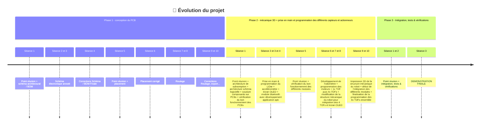

# 🤖 ENSEA_3AProject_ChaSouRo 🤖

## 📋 Table des matières

- [Équipe](#équipe)
- [Introduction](#introduction)
- [Missions & Objectifs](#missions-et-objectifs)
- [Timeline](#planning-d'avancement)
- [Journal de bord](#journal-de-bord)

---

## 👨🏽 Équipe

   **🙋‍♂️ [Hugo CARVALHO FONTES](https://github.com/HugouShare)**

   **🙋‍♂️ [Nelven THÉBAULT](https://github.com/NelvTheb)**

   **🙋‍♂️ [Hugo CORDI](https://github.com/Lynxlegrand)**

   **🙋‍♂️ [Arthur Cesar NJITCHOU NKWA](https://github.com/ArthurNjitchou)**

## ⚙️ Introduction

- Nous réalisons ce projet dans le cadre de notre dernière année d'étude en spécialité électronique et systèmes embarqués à l'[ENSEA](https://www.ensea.fr/fr) située à Cergy.
- Le but du projet est de réaliser deux robots : l'un étant le robot chat et l'autre le robot souris. Les deux robots évoluent ensuite de manière autonome sur une table. Le but du jeu est alors le suivant : le robot chat doit tenter d'attraper le robot souris qui doit donc tenter d'échapper au robot chat. Une fois que le robot chat attrape le robot souris, les rôles s'inversent et la partie continue. 

## 🎯 Missions & Objectifs

Les missions principales sont les suivantes (réparties selon différents niveaux) :
  - **Niveau 0 :**
    - Le robot se déplace
    - Il ne tombe pas de la table
  - **Niveau 1 :**
    - Il détecte et se dirige vers un objet
    - Ou s’en éloigne s’il n’est pas le chat
  - **Niveau 2 :**
    - Il change de comportement (proie/prédateur) après un contact
    - Il fonctionne avec plusieurs robots sur la table
  - **Niveau 3 :**
    - Il n’est pas affecté par les obstacles hors de la table
    - Il est donc capable de se localiser

## ⌚ Timeline

## 📝 Journal des activités

Pour consulter notre journal des activités [cliquez ici](Documents/Journal%20de%20bord.md)  

## ✅ A faire 

- Diagramme UML (des fichiers, des drivers, pas forcément au format normé)
- Diagramme des tâches
- Diagramme hardware (signaux, composants, ...)
