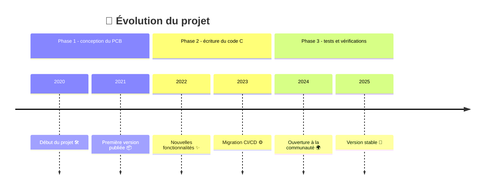

# 🤖 ENSEA_3AProject_ChaSouRo 🤖

## 📋 Table des matières

- [Équipe](#équipe)
- [Introduction](#introduction)
- [Missions & Objectifs](#missions-et-objectifs)
- [Timeline](#planning-d'avancement)
- [Journal de bord](#journal-de-bord)

---

## 👨🏽 Équipe

   **🙋‍♂️ [Hugo CARVALHO FONTES](https://github.com/HugouShare)**

   **🙋‍♂️ [Nelven THÉBAULT](https://github.com/NelvTheb)**

   **🙋‍♂️ [Hugo CORDI](https://github.com/Lynxlegrand)**

   **🙋‍♂️ [Arthur Cesar NJITCHOU NKWA]()**

## ⚙️ Introduction

- Nous réalisons ce projet dans le cadre de notre dernière année d'étude en spécialité électronique et systèmes embarqués à l'[ENSEA](https://www.ensea.fr/fr) située à Cergy.
- Le but du projet est de réaliser deux robots : l'un étant le robot chat et l'autre le robot souris. Les deux robots évoluent ensuite de manière autonome sur une table. Le but du jeu est alors le suivant : le robot chat doit tenter d'attraper le robot souris qui doit donc tenter d'échapper au robot chat. Une fois que le robot chat attrape le robot souris, les rôles s'inversent et la partie continue. 

## 🎯 Missions & Objectifs

- Les missions principales sont les suivantes :
   - **Mission 1 : Séparation & Transmission**
      - Blablabla...

## ⌚ Timeline

## 📋 Journal de bord

Pour consulter notre journal de bord [cliquez ici](Documents/Journal-debord.txt)
